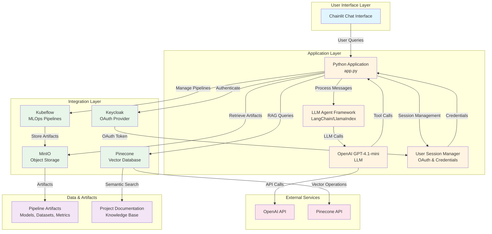

# Conversational AI for Human-Machine Collaborative MLOps

## Overview

The HumAIne Swarm project provides an intelligent assistant, the "HumAIne Swarm Assistant," designed to support researchers and developers within the [HumAIne EU-funded research project](https://humaine-horizon.eu/). This assistant facilitates AI/ML development by enabling conversational interaction with the project's MLOps infrastructure, primarily Kubeflow and MinIO, as well as providing access to project-specific knowledge.

The project leverages Large Language Models (LLMs) through libraries such as OpenAI, LangChain, and LlamaIndex, with a user interface built using Chainlit. The core idea is to enable "Swarm Learning" principles, fostering collaboration between humans and AI models, orchestrated by LLM agents.

## Architecture and Key Technologies

*   **Conversational AI:**
    *   **LLM:** Utilizes OpenAI models for understanding queries and generating responses.
    *   **Agent Framework:** Leverages LangChain and LlamaIndex for building advanced agentic RAG (Retrieval Augmented Generation) applications.
    *   **User Interface:** Employs Chainlit to provide an interactive chat interface.
*   **MLOps & Infrastructure Interaction:**
    *   **Kubeflow:** Agents can interact with Kubeflow to manage pipelines (list, get details, run, manage versions), experiments, and runs.
    *   **MinIO:** Agents can access and manage data in MinIO object storage, including listing buckets, retrieving pipeline artifacts (datasets, models, metrics, visualizations), and comparing run outputs.
*   **Knowledge Management:**
    *   **Vector Database:** Uses Pinecone for storing and retrieving information via semantic search (RAG), allowing users to query project documentation and related knowledge.
*   **Core Backend:**
    *   **Language:** Python
    *   **Dependency Management:** Poetry


## Architecture Diagram

The following diagram illustrates the system architecture and component interactions:



### Component Interactions

1. **User Interface**: Chainlit provides the conversational chat interface where users interact with the assistant.

2. **Application Core**: 
   - The main application (`app.py`) orchestrates user interactions
   - LLM Agent Framework processes queries and manages tool calls
   - OpenAI GPT-4.1-mini generates responses and decides which tools to use
   - User Session Manager handles OAuth authentication and credential management

3. **MLOps Infrastructure**:
   - **Kubeflow**: Manages ML pipelines, experiments, and runs
   - **MinIO**: Stores pipeline artifacts (models, datasets, metrics, visualizations)
   - **Pinecone**: Provides semantic search over project documentation via RAG

4. **Authentication**: Keycloak provides OAuth-based authentication, enabling secure access to Kubeflow and MinIO resources.

5. **External APIs**: OpenAI and Pinecone APIs are called for LLM inference and vector operations respectively.

## Capabilities

The HumAIne Swarm Assistant can perform a wide range of tasks, including:

*   **Documentation & Information Retrieval:**
    *   Answer questions about the HumAIne project.
    *   Retrieve relevant documents and information using RAG from a Pinecone vector store.
    *   Optimize user queries for better information retrieval.
*   **Kubeflow Management:**
    *   List available Kubeflow pipelines, experiments, and runs.
    *   Provide detailed information about specific pipelines, versions, runs, and experiments.
    *   Trigger and monitor Kubeflow pipeline executions.
    *   Create and manage Kubeflow experiments.
    *   Retrieve user-specific Kubeflow namespace information.
*   **MinIO Storage Interaction:**
    *   List MinIO buckets and their contents.
    *   Retrieve and inspect pipeline artifacts (models, datasets, metrics files, HTML visualizations) stored in MinIO.
    *   Compare metrics from different pipeline runs.
*   **ML Workflow Support:**
    *   Guide users in setting up and running ML pipelines.
    *   Provide information about available ML components, models, and datasets.
    *   Assist in troubleshooting common ML pipeline issues.

## Getting Started

### Local Development

1.  **Environment Setup:**
    *   Copy `env.sh.example` to `env.sh`.
    *   Fill in the required environment variables in `env.sh` (OpenAI API key, Pinecone API key, MinIO credentials, Kubeflow details, etc.).
    *   Source the environment: `source env.sh`
2.  **Install Dependencies:**
    *   Ensure you have Python (>=3.11, <3.13) and Poetry installed.
    *   Run `poetry install` to install project dependencies.
3.  **Run the Application:**
    *   Execute `chainlit run app.py -w` to start the Chainlit application.


### Docker Deployment

1.  **Build the Docker image:**
    ```bash
    docker build -t humaine-swarm:latest .
    ```

2.  **Create and configure environment file:**
    ```bash
    # Create .env file from template
    cp .env-example .env
    ```
    
    Edit the `.env` file and fill in the required environment variables:
    *   `OPENAI_API_KEY` - Your OpenAI API key
    *   `PINECONE_API_KEY` - Your Pinecone API key
    *   `OAUTH_KEYCLOAK_CLIENT_SECRET` - Your Keycloak client secret
    *   `MINIO_ENDPOINT` - MinIO endpoint URL (default: `s3-minio.humaine-horizon.eu`)
    *   `KUBEFLOW_HOST` - Kubeflow host URL (default: `http://huanew-kubeflow.ddns.net/pipeline`)
    *   `LOG_LEVEL` - Logging level (default: `ERROR`)
    
    You can edit the file using your preferred text editor:
    ```bash
    nano .env
    # or
    vim .env
    ```

3.  **Run the container:**
    ```bash
    docker run -d \
      --name humaine-swarm-assistant \
      -p 8000:8000 \
      --env-file .env \
      --restart unless-stopped \
      humaine-swarm:latest
    ```

### Using Pre-built Docker Image from Docker Hub

The easiest way to get started is to use the pre-built image from Docker Hub. No need to build the image yourself!

1.  **Pull the image from Docker Hub:**
    ```bash
    docker pull gfatouros/humaine-swarm:latest
    ```

2.  **Create and configure environment file:**
    ```bash
    # Create .env file from template
    cp .env-example .env
    ```
    
    Edit the `.env` file and fill in the required environment variables:
    *   `OPENAI_API_KEY` - Your OpenAI API key
    *   `PINECONE_API_KEY` - Your Pinecone API key
    *   `OAUTH_KEYCLOAK_CLIENT_SECRET` - Your Keycloak client secret
    *   `KUBEFLOW_HOST` - Kubeflow host URL (default: `http://huanew-kubeflow.ddns.net/pipeline`)
    
    You can edit the file using your preferred text editor:
    ```bash
    nano .env
    # or
    vim .env
    ```

3.  **Run the container:**
    ```bash
    docker run -d \
      --name humaine-swarm-assistant \
      -p 8000:8000 \
      --env-file .env \
      --restart unless-stopped \
      gfatouros/humaine-swarm:latest
    ```

The application will be available at `http://localhost:8000`.

## Usage

Once the application is running, open your browser to the address provided by Chainlit (usually `http://localhost:8000`). You can then interact with the "HumAIne Swarm Assistant" through the chat interface.

Ask questions or give commands related to your ML workflows, Kubeflow pipelines, MinIO artifacts, or the HumAIne project. For example:

*   "List all Kubeflow pipelines."
*   "Show me the details for pipeline ID 'xyz'."
*   "Run the 'training-pipeline' with parameter 'epochs=10'."
*   "What artifacts are available for the latest run of the 'data-processing' pipeline?"
*   "Compare the accuracy of run 'abc' and run 'def' for the 'classification-model'."
*   "Tell me about the goals of the HumAIne project."

The assistant will use its configured tools to fetch information and execute tasks, providing responses and results in the chat.

## Citation

If you use this in your research please cite:

```bibtex
@INPROCEEDINGS{11096208,
  author={Fatouros, George and Makridis, Georgios and Kousiouris, George and Soldatos, John and Tsadimas, Anargyros and Kyriazis, Dimosthenis},
  booktitle={2025 21st International Conference on Distributed Computing in Smart Systems and the Internet of Things (DCOSS-IoT)}, 
  title={Towards Conversational AI for Human-Machine Collaborative MLOps}, 
  year={2025},
  pages={1079-1086},
  doi={10.1109/DCOSS-IoT65416.2025.00162}}
```

## Acknowledgements
The project has received funding from the European Union's funded Project HEU HUMAINE under Grant Agreement No. 101120218.

## License

Apache License 2.0 (as per `pyproject.toml` and `LICENSE` file)

