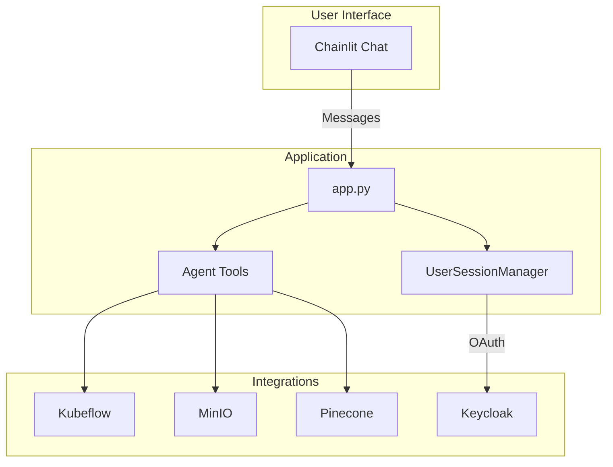

# HumAIne Swarm Documentation

Documentation for the **HumAIne Swarm Assistant**: a conversational AI that supports researchers and developers in the [HumAIne EU-funded research project](https://humaine-horizon.eu/) by enabling interaction with MLOps infrastructure (Kubeflow, MinIO) and project knowledge (RAG).

For project overview, setup, and deployment see the root [README.md](../README.md).

## High-level architecture

---

## For end users

Training material for researchers and ML practitioners using the assistant.

| Document | Description |
|----------|-------------|
| [Overview](users/01-overview.md) | Role of the assistant, capability summary, capability map |
| [Getting started](users/02-getting-started.md) | Login, first steps, starter prompts, where to run |
| [Capabilities](users/03-capabilities.md) | What you can ask: documentation, Kubeflow, MinIO, PDF, plotting |
| [Concepts](users/04-concepts.md) | run_id vs run_name, buckets, namespace, sessions |
| [Workflows](users/05-workflows.md) | End-to-end workflows: run pipeline, analyze results, query docs |

---

## For developers

Technical documentation for extending or deploying the application.

| Document | Description |
|----------|-------------|
| [Architecture](developers/01-architecture.md) | Components, integrations, config and env |
| [App flow](developers/02-app-flow.md) | Message handling, stream processing, tool calls, context |
| [Agents and tools](developers/03-agents-and-tools.md) | System prompt, tool definitions, implementations by domain |
| [Session and auth](developers/04-session-and-auth.md) | OAuth, UserSessionManager, MinIO STS, Kubeflow auth |
| [Data injection](developers/05-data-injection.md) | Populating the Pinecone RAG index from `.docs` |
| [Utils and config](developers/06-utils-and-config.md) | config.py, helper_functions.py |
| [Tool reference](developers/07-tool-reference.md) | Quick lookup: tool name, params, location, dependencies |
