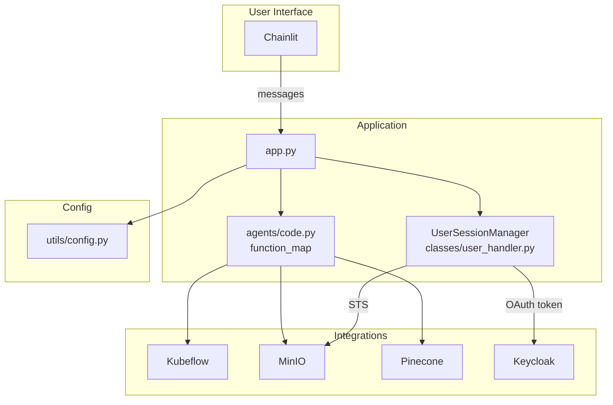

# Architecture

## Component overview

| Component | Location | Role |
|-----------|----------|------|
| Chainlit UI | Chainlit framework | Chat interface; OAuth; session; message display |
| Application entrypoint | [app.py](../../app.py) | `@cl.on_message`, `@cl.on_chat_start`, `@cl.oauth_callback`; orchestrates message handling and stream processing |
| OpenAI client | app.py, agents/code.py | Streaming completions with tool calls; LLM for RAG (optional) |
| Agent tools | [agents/code.py](../../agents/code.py) | `function_map`: name → async callable; all tool implementations |
| Tool definitions | [agents/definition.py](../../agents/definition.py) | OpenAI function schemas passed in `settings["tools"]` |
| System prompt | [agents/system.md](../../agents/system.md) | Loaded via `read_prompt('system')` in agents/code.py |
| Session manager | [classes/user_handler.py](../../classes/user_handler.py) | `UserSessionManager`: message history, OAuth, MinIO/Kubeflow credentials, namespace |
| Config | [utils/config.py](../../utils/config.py) | Env-derived settings; OpenAI `settings` dict |
| Helpers | [utils/helper_functions.py](../../utils/helper_functions.py) | MinIO client, Kubeflow client (Dex), STS credential fetch, namespace extraction |

Integrations: **Kubeflow** (pipelines, runs, experiments), **MinIO** (buckets, artifacts; user-scoped via STS), **Pinecone** (vector index for RAG), **Keycloak** (OAuth provider).

## Component diagram

## Data flow (summary)

- **Request**: User message → Chainlit → `main()` in app.py → message history updated → `client.chat.completions.create(..., stream=True)` with `cl.chat_context.to_openai()` and `settings` (includes `tools` from agents/definition.py).
- **Response**: Stream consumed in `process_stream()`; text deltas streamed to UI; tool_calls accumulated, validated (JSON), executed concurrently via `function_map`; results appended to history; if any tool ran, follow-up completion; optional Plotly elements for `plot_data`.
- **Session**: Per-user state in Chainlit; OAuth token and MinIO credentials (from Keycloak STS) and Kubeflow namespace (from token claims) set on chat start; tool code obtains user-scoped clients via `UserSessionManager` / helpers.

## Config and environment

Configuration is env-driven. See [utils/config.py](../../utils/config.py) for all keys. Main ones:

- **Kubeflow**: `KUBEFLOW_HOST`
- **MinIO**: `MINIO_ENDPOINT`, `MINIO_SECURE`, optional `MINIO_API_ENDPOINT`, `MINIO_STS_ENDPOINT`
- **Pinecone**: `PINECONE_API_KEY`; index name in config: `PINECONE_INDEX` = `humaine`
- **LLM**: `LLM_MODEL`, `LLM_MAX_TOKENS`, `LLM_TEMPERATURE`; OpenAI API key via `OPENAI_API_KEY`
- **Auth**: Keycloak configured in Chainlit (OAuth); `OAUTH_KEYCLOAK_*` etc. as per Chainlit docs

Full deployment and env setup: root [README.md](../../README.md) and `.env-example`.
