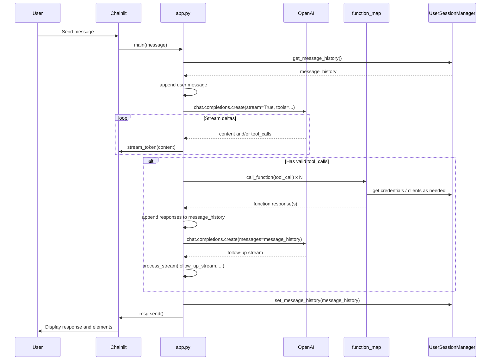

# App flow

## Message handling path

1. User sends a message in the Chainlit UI.
2. **`@cl.on_message`** invokes **`main(message)`** in [app.py](../../app.py).
3. **Message history**: `UserSessionManager.get_message_history()`; append `{"role": "user", "content": message.content}`.
4. **OpenAI call**: `client.chat.completions.create(messages=cl.chat_context.to_openai(), **settings)`.
   - `settings` from [utils/config.py](../../utils/config.py): model, temperature, max_tokens, **tools** (from agents/definition.py), **tool_choice**: "auto", **stream**: True.
   - Chainlit’s `cl.chat_context.to_openai()` supplies the conversation in OpenAI format (including system prompt from session).
5. **Stream processing**: `process_stream(completion, message_history, msg)`.
6. After the stream: append assistant content to history if non-empty; persist via `UserSessionManager.set_message_history(message_history)`; send `msg` (and any elements) to the UI.

## Stream processing (`process_stream`)

Implemented in [app.py](../../app.py).

- **Input**: Async stream from OpenAI, current `message_history`, and a Chainlit `Message` object `msg` for this turn.
- **Loop** over stream deltas:
  - **Content deltas**: Appended to `text_content` and streamed to the UI with `msg.stream_token(delta.content)`.
  - **Tool-call deltas**: Accumulated into `tool_calls_data`. Each tool call has `id`, `type`, `function.name`, `function.arguments` (string); arguments are concatenated as chunks arrive.
- **After stream**: Tool-call argument strings are validated (non-empty, ends with `}`, `json.loads`). Only valid tool calls are executed.
- **Execution**: For each valid tool call, `call_function(tool_call)`:
  - Looks up `function_map[function_name]` in [agents/code.py](../../agents/code.py).
  - Parses arguments and runs `await func(**arguments)` (or sync equivalent).
  - **Plotly**: If tool is `plot_data` and result contains `figure_json`, a `cl.Plotly` element is appended to `msg.elements`.
  - Returns `{"role": "function", "name": function_name, "content": json.dumps(result)}`.
- **Concurrency**: All valid tool calls for the turn are run with `asyncio.gather(*(call_function(tc) for tc in valid_tool_calls))`.
- **Follow-up**: All function responses are appended to `message_history`; if any response exists, a follow-up `client.chat.completions.create(messages=message_history, **settings)` is made and **`process_stream` is called again** on the new stream (so the model can synthesize a final answer or issue further tool calls). If `msg` had elements (e.g. Plotly), a new message is created with those elements before the follow-up so the chart is displayed; otherwise the same `msg` is reused.

## Sequence diagram

## Context and history

- **Storage**: Message history is kept in Chainlit user session via `UserSessionManager.set_message_history()` / `get_message_history()` ([classes/user_handler.py](../../classes/user_handler.py)).
- **Truncation**: `set_message_history()` uses **tiktoken** (encoding for `gpt-4o-mini`) to count tokens. It keeps the system message and then as many most recent messages as fit within `MAX_INPUT_TOKENS` (from [utils/config.py](../../utils/config.py): `MAX_CONTEXT_LENGTH - max_tokens`). Older messages are dropped from the front (after system).
- **Note**: `manage_chat_history()` in [utils/helper_functions.py](../../utils/helper_functions.py) (character-based sliding window) exists but is **not used** by the app; history is managed only via `UserSessionManager` and token-based truncation.
