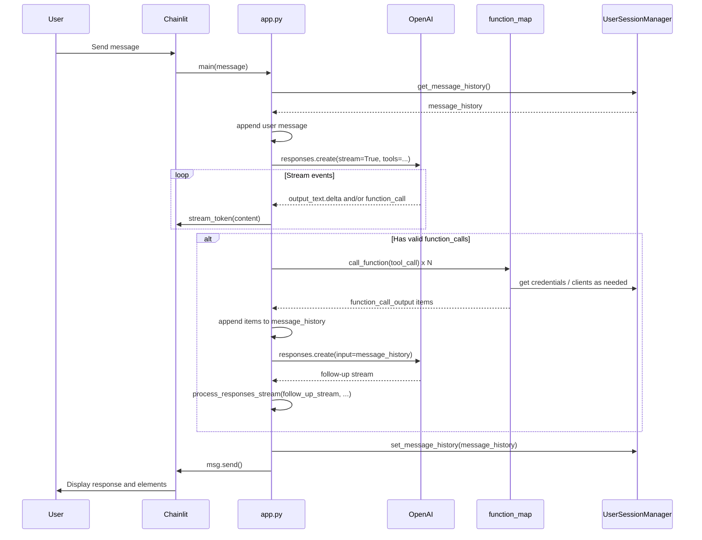

# App flow

## Message handling path

1. User sends a message in the Chainlit UI.
2. **`@cl.on_message`** invokes **`main(message)`** in [app.py](../../app.py).
3. **Message history**: `UserSessionManager.get_message_history()`; append `{"role": "user", "content": message.content}`.
4. **OpenAI call**: `create_response_stream(message_history)` → `client.responses.create(input=..., instructions=..., **settings)`.
   - `settings` from [utils/config.py](../../utils/config.py): model, **tools**, **reasoning**, **max_output_tokens**, **stream**: True.
   - `message_history` is the single source of truth (system prompt extracted to `instructions` via [utils/responses_adapter.py](../../utils/responses_adapter.py)).
5. **Stream processing**: `process_responses_stream(stream, message_history, msg)`.
6. After the stream: append assistant content to history if non-empty; persist via `UserSessionManager.set_message_history(message_history)`; send `msg` (and any elements) to the UI.

## Stream processing (`process_responses_stream`)

Implemented in [app.py](../../app.py).

- **Input**: Async Responses API stream, current `message_history`, and a Chainlit `Message` object `msg` for this turn.
- **Loop** over stream events:
  - **`response.output_text.delta`**: Appended to `text_content` and streamed to the UI with `msg.stream_token(event.delta)`.
  - **`response.output_item.added`** (`function_call`): Registers tool calls keyed by `item_id`.
  - **`response.function_call_arguments.delta` / `.done`**: Accumulates JSON arguments per tool call.
- **After stream**: Tool-call argument strings are validated (non-empty, ends with `}`, `json.loads`). Only valid tool calls are executed.
- **Execution**: For each valid tool call, `call_function(tool_call)`:
  - Looks up `function_map[function_name]` in [agents/code.py](../../agents/code.py).
  - Parses arguments and runs `await func(**arguments)` (or sync equivalent).
  - **Plotly**: If tool is `plot_data` and result contains `figure_json`, a `cl.Plotly` element is appended to `msg.elements`.
  - Returns `function_call` and `function_call_output` items for history.
- **Concurrency**: All valid tool calls for the turn are run with `asyncio.gather`.
- **Follow-up**: Tool items are appended to `message_history`; if any ran, a follow-up `create_response_stream(message_history)` is made and **`process_responses_stream` is called again** (so the model can synthesize a final answer or issue further tool calls). If `msg` had elements (e.g. Plotly), a new message is created with those elements before the follow-up so the chart is displayed; otherwise the same `msg` is reused.

## Sequence diagram

```mermaid
sequenceDiagram
    participant User
    participant Chainlit
    participant app_py as app.py
    participant OpenAI
    participant function_map as function_map
    participant Session as UserSessionManager

    User->>Chainlit: Send message
    Chainlit->>app_py: main(message)
    app_py->>Session: get_message_history()
    Session-->>app_py: message_history
    app_py->>app_py: append user message
    app_py->>OpenAI: responses.create(stream=True, tools=...)
    loop Stream events
        OpenAI-->>app_py: output_text.delta and/or function_call
        app_py->>Chainlit: stream_token(content)
    end
    alt Has valid function_calls
        app_py->>function_map: call_function(tool_call) x N
        function_map->>Session: get credentials / clients as needed
        function_map-->>app_py: function_call_output items
        app_py->>app_py: append items to message_history
        app_py->>OpenAI: responses.create(input=message_history)
        OpenAI-->>app_py: follow-up stream
        app_py->>app_py: process_responses_stream(follow_up_stream, ...)
    end
    app_py->>Session: set_message_history(message_history)
    app_py->>Chainlit: msg.send()
    Chainlit->>User: Display response and elements
```

## Context and history

- **Storage**: Message history is kept in Chainlit user session via `UserSessionManager.set_message_history()` / `get_message_history()` ([classes/user_handler.py](../../classes/user_handler.py)). Tool turns store typed `function_call` / `function_call_output` items.
- **Truncation**: `set_message_history()` uses **tiktoken** (`o200k_base` encoding) and `item_token_estimate()` from [utils/responses_adapter.py](../../utils/responses_adapter.py). It keeps the system message and then as many most recent items as fit within `MAX_INPUT_TOKENS` (from [utils/config.py](../../utils/config.py): `MAX_CONTEXT_LENGTH - OUTPUT_TOKEN_RESERVE`). Older items are dropped from the front (after system).
- **Note**: `manage_chat_history()` in [utils/helper_functions.py](../../utils/helper_functions.py) (character-based sliding window) exists but is **not used** by the app; history is managed only via `UserSessionManager` and token-based truncation.
