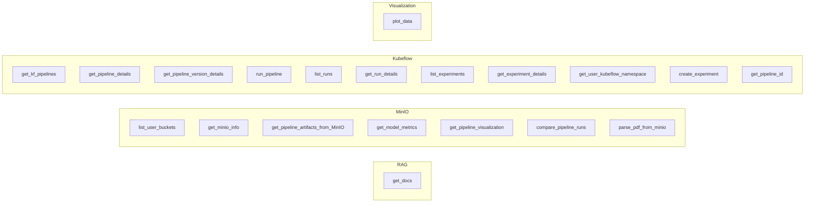

# Agents and tools

## Agent definition

The assistant’s behaviour is defined by a **system prompt** in [agents/system.md](../../agents/system.md). It states:

- **Role**: HumAIne Swarm Assistant; support for AI/ML development and MLOps (Kubeflow, MinIO, project knowledge).
- **Responsibilities**: Support ML workflows; understand queries; call appropriate tools; synthesize and respond.
- **Tool guidelines**: Use `list_user_buckets()` first for MinIO; required params for `compare_pipeline_runs`; distinction between **run_id** (Kubeflow) and **run_name** (MinIO path).
- **Context**: Use prior messages to tailor answers.
- **Security**: Do not share credentials or sensitive details; refuse off-topic or harmful requests.

The prompt is loaded in [agents/code.py](../../agents/code.py) via **`read_prompt('system')`**, which reads `agents/system.md` and appends the current date and a short note about incorporating function results. The result is set as the initial system message in session on chat start ([app.py](../../app.py) `start_chat()`).

## Tool definitions

[agents/definition.py](../../agents/definition.py) exports a list **`functions`**: OpenAI function-calling schemas (`type`, `function.name`, `function.description`, `function.parameters`). This list is imported in [utils/config.py](../../utils/config.py) and passed as **`settings["tools"]`** to every `client.chat.completions.create()` call. The model uses these schemas to decide when and how to call tools.

## Tool implementation

[agents/code.py](../../agents/code.py) implements each tool as an **async function** and registers it in **`function_map`** (name → callable). [app.py](../../app.py) looks up by name in `function_map` and executes with the parsed JSON arguments. Tool functions are decorated with **`@cl.step(type="tool", ...)`** so Chainlit shows tool activity in the UI.

## Tools by domain

### RAG

- **get_docs(query)**  
  Uses **LlamaIndex**: `PineconeVectorStore` (index from [utils/config.py](../../utils/config.py): `PINECONE_INDEX`), `VectorStoreIndex`, `VectorIndexRetriever` with **similarity_top_k=10**. Retrieves nodes, then formats with **`rag_extract_deliverables()`** from [utils/helper_functions.py](../../utils/helper_functions.py) (list of `{text: node content}`).  
  **Note**: `optimize_query()` exists in code.py but is **not called** by `get_docs`; the user query is used as-is.

### MinIO

All MinIO tools use a **user-scoped client**: **`get_user_minio_client()`** in code.py, which calls **`UserSessionManager.get_or_refresh_minio_credentials()`** and then **`get_minio_client(user_credentials)`** from helper_functions. If no user credentials are available, it falls back to env-based client.

- **list_user_buckets(max_buckets)** — List buckets; optional ML/pipeline hints from paths.
- **get_minio_info(bucket_name, prefix?, max_items?)** — List objects under bucket/prefix.
- **get_pipeline_artifacts_from_MinIO(bucket_name, pipeline_name?, run_name?, artifact_type?, max_items?, object_path?)** — List or fetch artifacts; `object_path` can retrieve a single file.
- **get_model_metrics(bucket_name, pipeline_name?, run_name?, model_name?, max_items?, metrics_path?)** — Load metrics JSON(s) from `metrics/` paths.
- **get_pipeline_visualization(bucket_name, pipeline_name?, run_name?, visualization_type?, model_name?, visualization_path?)** — Fetch HTML (e.g. confusion matrix, ROC, feature importance).
- **compare_pipeline_runs(bucket_name, pipeline_name, run_names, metric_names?)** — Aggregate metrics across runs; compute best run per metric.
- **parse_pdf_from_minio(bucket_name, object_path, summarize?, chunk_size?, chunk_overlap?, summary_type?)** — Download PDF from MinIO, extract text (PyPDFLoader), chunk (RecursiveCharacterTextSplitter), optional LangChain summarization; can send PDF to UI as `cl.Pdf`.

### Kubeflow

Kubeflow tools use **`get_user_kubeflow_client()`** in code.py: it prefers session-stored credentials (username/password); if missing, it can **prompt the user** via Chainlit for Kubeflow username/password/namespace, then creates a client via **`get_kubeflow_client()`** in helper_functions. The client is built by **`KFPClientManager`**: Dex login (session cookies), then `kfp.Client(host, cookies, namespace)`.

- **get_kf_pipelines**, **get_pipeline_details**, **get_pipeline_version_details**, **run_pipeline**, **list_runs**, **get_run_details**, **list_experiments**, **get_experiment_details**, **get_user_kubeflow_namespace**, **create_experiment**, **get_pipeline_id** — All implemented in code.py; delegate to the KFP client and map responses to dicts.

### Visualization

- **plot_data(data, chart_type?, title?, x_label?, y_label?, x_column?, y_column?, color_column?, display?, size?)**  
  Builds a Plotly figure in code.py (`_determine_chart_type`, `_create_plotly_figure`), serializes to JSON, returns `{figure_json, chart_type, title, display, size, success}`. [app.py](../../app.py) detects `plot_data` results and attaches a **`cl.Plotly`** element to the message so the chart renders in the UI.

## RAG pipeline (index side)

The index used by `get_docs` is populated by a separate process (see [Data injection](05-data-injection.md)): PDFs under `.docs` are loaded, chunked (SemanticChunker), embedded (OpenAI text-embedding-3-small), and upserted into Pinecone index `humaine`. At runtime, only retrieval runs; no query rewriting is applied in the current code path.
