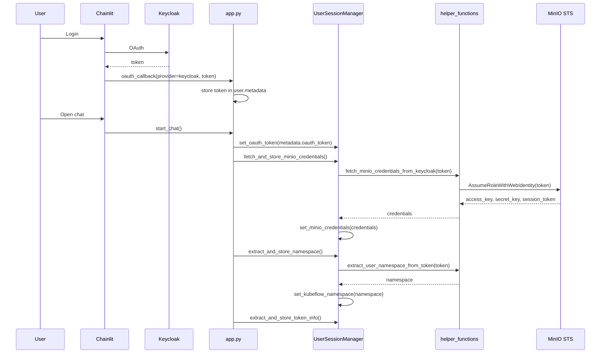

# Session and authentication

## OAuth (Keycloak)

- **Callback**: In [app.py](../../app.py), **`@cl.oauth_callback`** handles the Keycloak provider. On success it stores in the default user object: `metadata["oauth_token"]`, `metadata["provider"]` = "keycloak", and `metadata["raw_user_data"]`. Chainlit then uses this user for the session.
- **On chat start**: In **`start_chat()`**, the user is read from `cl.user_session.get("user")`. If `user.metadata` contains **"oauth_token"**, it is stored in session via **`UserSessionManager.set_oauth_token(user.metadata["oauth_token"])`**.

## Chat start sequence

1. **System prompt**: Initial message `[{"role": "system", "content": system_prompt}]` is set with **`UserSessionManager.set_message_history(init_message)`**.
2. **User ID**: **`UserSessionManager.set_user_id(user.identifier)`**.
3. **If OAuth token is present**:
   - **MinIO credentials**: **`UserSessionManager.fetch_and_store_minio_credentials()`** is awaited. It uses **`fetch_minio_credentials_from_keycloak(oauth_token)`** in [utils/helper_functions.py](../../utils/helper_functions.py) (MinIO STS AssumeRoleWithWebIdentity), then **`set_minio_credentials(credentials)`**. On failure (e.g. expired token), session is cleared and a “session expired” message is sent; chat start returns early.
   - **Namespace**: **`UserSessionManager.extract_and_store_namespace()`** — reads namespace from token (see below) and stores it.
   - **Token metadata**: **`UserSessionManager.extract_and_store_token_info()`** — extracts policies, roles, and metadata (email, preferred_username, exp, iat, etc.) and stores them.

## UserSessionManager

Implemented in [classes/user_handler.py](../../classes/user_handler.py). All state is in Chainlit user session (`cl.user_session`).

| Concern | Methods | Notes |
|--------|---------|-------|
| Message history | `get_message_history`, `set_message_history` | Token-based truncation (tiktoken, MAX_INPUT_TOKENS); system message always kept |
| User ID | `set_user_id`, `get_user_id` | From Chainlit user (identifier, metadata email/sub/preferred_username) |
| OAuth token | `set_oauth_token`, `get_oauth_token` | Keycloak access token |
| MinIO credentials | `set_minio_credentials`, `get_minio_credentials`, `are_minio_credentials_valid`, `fetch_and_store_minio_credentials`, `get_or_refresh_minio_credentials` | access_key, secret_key, session_token, expiry; refresh on expiry or when “should refresh” (exp &lt; 5 min) |
| Kubeflow namespace | `set_kubeflow_namespace`, `get_kubeflow_namespace`, `extract_and_store_namespace` | From token claims |
| Kubeflow credentials | `set_kubeflow_credentials`, `get_kubeflow_credentials`, `has_kubeflow_credentials`, `clear_kubeflow_credentials` | Username, password, optional namespace (Dex auth) |
| Token metadata | `set_token_metadata`, `get_token_metadata`, `extract_and_store_token_info` | exp, email, roles, policies, etc. |
| Policies / roles | `set_user_policies`, `get_user_policies`, `set_user_roles`, `get_user_roles` | From token (MinIO policies, Keycloak roles) |
| Refresh / clear | `should_refresh_token`, `clear_session` | Proactive refresh when exp &lt; 5 min; clear on token expiry |

**`get_or_refresh_minio_credentials()`**: If credentials are invalid or about to expire, tries to refresh. On “token expired” errors it calls **`clear_session()`** and (if possible) sends a “session expired” message so the user re-authenticates.

## MinIO credentials (STS)

In [utils/helper_functions.py](../../utils/helper_functions.py):

- **`fetch_minio_credentials_from_keycloak(access_token)`**:  
  - Optionally decodes JWT (no verify) to check `exp`; raises if token expired.  
  - Builds STS URL from **MINIO_STS_ENDPOINT** or from **MINIO_ENDPOINT** (with hostname/port rules and a fallback for a known wrong hostname).  
  - POSTs **AssumeRoleWithWebIdentity** (Version 2011-06-15, DurationSeconds 43200, WebIdentityToken = access_token).  
  - On 200: parses XML for AccessKeyId, SecretAccessKey, SessionToken, Expiration; returns dict with **access_key**, **secret_key**, **session_token**, **expiry**.  
  - On HTML response (e.g. proxy routing to console), tries alternative paths (`/minio/sts`, `/sts`, `/api/sts`).  
  - Raises on non-200, empty body, or missing credential fields.

- **`get_minio_client(user_credentials=None)`**: Builds **Minio** client from **MINIO_API_ENDPOINT** or **MINIO_ENDPOINT** / **MINIO_SECURE**; if `user_credentials` is provided uses those (access_key, secret_key, session_token); else uses env vars (MINIO_ACCESS_KEY, etc.).

## Kubeflow namespace from token

**`extract_user_namespace_from_token(access_token)`** in [utils/helper_functions.py](../../utils/helper_functions.py):

- Decodes JWT with **options={"verify_signature": False}**.
- Tries in order: **namespace** claim; **groups** entry starting with `kubeflow-`; **realm_access.roles** with `kubeflow-`; **resource_access** roles with `kubeflow-`; then **preferred_username** or **email** normalized to `kubeflow-<value>`.
- Default: **"kubeflow"**.

## Kubeflow client (Dex)

- **`get_kubeflow_client(user_namespace, user_username, user_password)`** in [utils/helper_functions.py](../../utils/helper_functions.py):  
  Instantiates **KFPClientManager** with **KUBEFLOW_HOST**, skip_tls_verify=True, dex_username, dex_password, dex_auth_type="local". Calls **`create_kfp_client(namespace=user_namespace)`**, which performs Dex login (**`_get_session_cookies()`**: GET host, follow redirects to auth/login, POST login/password, optional approval POST), then returns **kfp.Client(host, cookies, namespace)**.

- **`get_user_kubeflow_client()`** in [agents/code.py](../../agents/code.py):  
  First uses **UserSessionManager.get_kubeflow_credentials()** and **has_kubeflow_credentials()**; if valid, builds client with those. On auth/credential errors it clears stored credentials and can re-prompt. If no credentials, it calls **`prompt_for_kubeflow_credentials()`** (Chainlit AskUserMessage for username, password, optional namespace), stores them, then creates the client. Retries up to **max_retries** (2) on invalid credentials.

## Auth/session flow diagram

