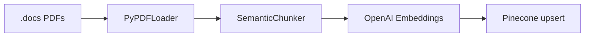

# Data injection

## Purpose

The **data injection** script populates the **Pinecone** vector index used by the RAG tool **get_docs**. Source content is taken from the local **`.docs`** directory (PDFs). Run it once or whenever `.docs` content changes so that the assistant can retrieve up-to-date project/Kubeflow documentation.

## Pipeline



1. **Load**: **`get_deliverables()`** in [data_injection.py](../../data_injection.py) walks **`.docs`** (project root). Every file is loaded with **LangChain `PyPDFLoader`**; all pages are concatenated into one string per file. Filename (no extension) is used as title.
2. **IDs**: A safe document id is derived from the title (ASCII-only, non-alphanumeric replaced with `_`).
3. **Chunk**: **`chunk_documents(df)`** uses **SemanticChunker** (LangChain experimental) with:
   - **embedding_model**: same as for embeddings (OpenAI text-embedding-3-small)
   - **breakpoint_threshold_type**: "gradient"
   - **min_chunk_size**: 100
   - **breakpoint_threshold_amount**: 0.8  
   Chunk ids: `{doc_id}_chunk_{i}`.
4. **Embed**: **`get_embeddings(text_list)`** calls **OpenAIEmbeddings(model=EMBED_MODEL)** with **EMBED_MODEL** = `"text-embedding-3-small"`.
5. **Upsert**: **`save_to_pinecone(df)`**:
   - **check_and_create_index**: if index **INDEX_NAME** (`"humaine"`) does not exist, create it with **ServerlessSpec(cloud="aws", region="us-east-1")**, **metric='dotproduct'**, dimension from the first embedding vector; wait until ready.
   - Batch upsert (batch_size 32); each vector has id, embedding, metadata **title** and **text** (chunk text).

## When to run

- After adding or updating PDFs in **`.docs`**.
- One-off setup for a new environment using the same index name.

Run from project root:

```bash
python data_injection.py
```

## Environment

- **PINECONE_API_KEY**: Required for Pinecone client and index operations.
- **OpenAI API key**: Required for embeddings (set as usual, e.g. OPENAI_API_KEY). The script uses **langchain_openai.embeddings.OpenAIEmbeddings**.

Index name is **humaine** (same as **PINECONE_INDEX** in [utils/config.py](../../utils/config.py) used by the chat app at runtime).
