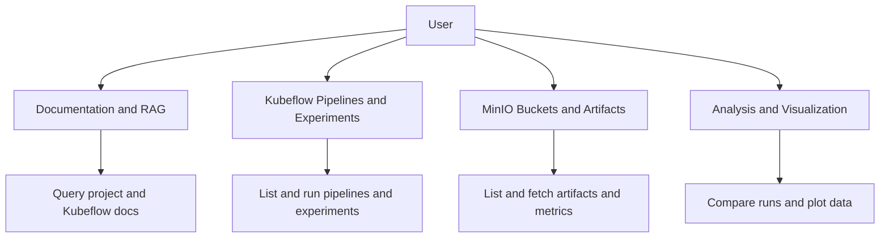

# Overview

## Role of the assistant

The **HumAIne Swarm Assistant** is a conversational AI for the [HumAIne EU-funded research project](https://humaine-horizon.eu/). It helps researchers and developers:

- Interact with **MLOps infrastructure** (Kubeflow pipelines, MinIO storage) without leaving the chat.
- Query **project and Kubeflow documentation** via semantic search (RAG).
- **Run pipelines**, inspect **runs and experiments**, and **analyze results** (metrics, visualizations, comparisons).

The assistant uses an LLM with tool-calling: it decides which tools to invoke from your message and then synthesizes a reply from the results.

## Capabilities at a glance

- **Documentation**: Answer questions about the HumAIne project and Kubeflow using a searchable knowledge base (RAG).
- **Kubeflow**: List pipelines and versions; get pipeline/version details; list runs and experiments; get run and experiment details; create experiments; run a pipeline; resolve pipeline ID by name; get your Kubeflow namespace.
- **MinIO**: List your buckets; list bucket contents; list or fetch pipeline artifacts (models, metrics, plots); get model metrics; get visualizations (confusion matrix, ROC curve, feature importance); compare metrics across runs; parse and optionally summarize a PDF from MinIO.
- **Analysis**: Compare pipeline runs by metrics; view inline Plotly charts (e.g. from metrics or custom data).

## Capability map

## In-app welcome

The chat UI shows a short welcome and example prompts when you open a conversation. That content is defined in the project’s [chainlit.md](../../chainlit.md) file.
