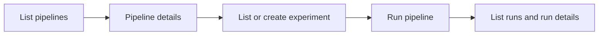
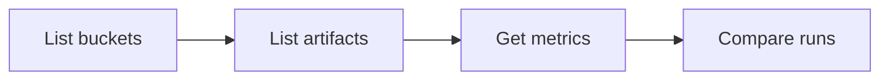

# Workflows

End-to-end workflows you can follow in the chat. Use these as training sequences; the assistant will call the right tools as you go.

## Discover and run a pipeline

1. **“List available pipelines”** or **“Show me pipelines”** — See pipelines you can run.
2. **“Show me details for pipeline [id]”** — Understand inputs and behaviour.
3. **“List my experiments”** — Find an experiment to run in, or create one.
4. **“Create an experiment called [name]”** — If you need a new experiment.
5. **“Run pipeline [id] in experiment [exp_id] with job name [name]”** — Add any parameters the pipeline needs (e.g. “with epochs=10”).
6. **“List runs for experiment [exp_id]”** or **“List my runs”** — See your run and its status.
7. **“Get details for run [run_id]”** — Check status, timing, and parameters.

## Analyze results (artifacts and metrics)

1. **“What buckets do I have access to?”** — Get your bucket name(s).
2. **“Show me artifacts for pipeline [pipeline_name] in bucket [bucket]”** — Optional: add run_name to narrow to one run.
3. **“Get metrics for pipeline [pipeline_name] in bucket [bucket]”** — Optional: “for run [run_name]”.
4. **“Compare runs [run1], [run2] for pipeline [name] in bucket [bucket]”** — Get a side-by-side comparison of metrics (and optionally which run is best per metric).

## Inspect model outputs (visualizations)

1. Identify **bucket**, **pipeline_name**, and **run_name** (e.g. from listing artifacts or runs).
2. **“Show me the confusion matrix for pipeline [name] run [run_name] in bucket [bucket]”** — Or ask for **ROC curve** or **feature importance** for that run.
3. The assistant returns the corresponding HTML visualization (or a link/path); it may be shown in the chat or sidebar depending on deployment.

## Query project and Kubeflow documentation

1. **“Tell me about the HumAIne project”** — High-level project info.
2. **“What are HumAIne’s AI paradigms?”** — Specific topics from the knowledge base.
3. **“How do I use Kubeflow pipelines in this project?”** or **“Documentation on [topic]”** — Retrieve and summarize relevant docs.

These use the RAG knowledge base (project/Kubeflow docs). Ask in natural language; the assistant will search and cite the retrieved passages.
